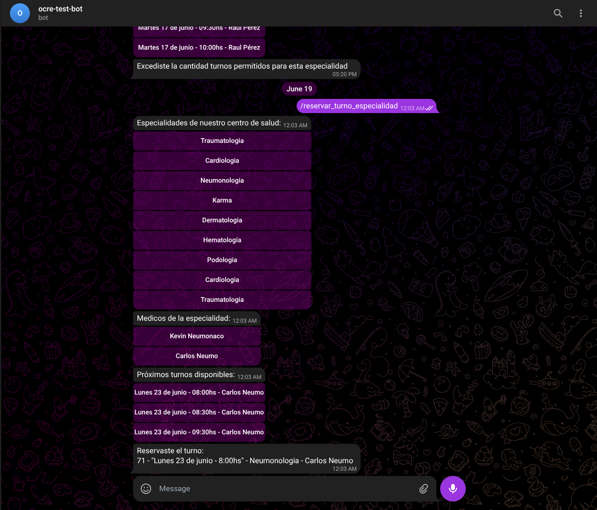

# Descripción

**Turnero Hospitalario** es un sistema dividido en dos componentes:
- **API REST**, desarrollada en **Ruby/Sinatra**, que gestiona médicos, pacientes, especialidades y turnos.
- **Bot de Telegram**, que actúa como interfaz para pacientes, permitiendo registrarse, consultar y reservar turnos médicos de manera simple e intuitiva.

El proyecto fue diseñado bajo el enfoque **BDD (Behavior Driven Development)**, utilizando **Cucumber/Gherkin** para definir y validar las historias de usuario del sistema.  
A continuación se resumen las principales funcionalidades cubiertas por las pruebas automatizadas.

---

# Captura de ejemplo

*Ejemplo del bot de Telegram mostrando la selección de turnos por especialidad.*

---

# Historias de usuario principales

## 🩺 ABM de Especialidades
- Crear especialidades válidas con límites de turnos por paciente y duración configurables.  
- Validar que los nombres sean alfabéticos y la duración de turnos no exceda los 90 minutos.  
- Manejar errores ante datos inválidos (por ejemplo: nombres con números o límites menores a 1).  

## 👨‍⚕️ ABM de Médicos
- Registrar médicos con matrícula válida (formato `AA9999AA`).  
- Asociar cada médico con una especialidad existente.  
- Validar que nombre, apellido y matrícula sigan formatos correctos.  
- Impedir duplicados de matrícula y normalizar letras a mayúsculas.

## 🧍‍♂️ ABM de Pacientes
- Registrar pacientes con DNI válido (hasta 8 dígitos, sin puntos).  
- Evitar duplicados de DNI y validar nombres y apellidos alfabéticos.  
- Permitir DNIs con menos de 8 dígitos como válidos.

## 📅 Reserva de Turnos
- Los pacientes pueden reservar turnos por **médico o especialidad**.  
- El sistema verifica:
  - Disponibilidad de horarios.
  - Que no haya superposición de turnos.
  - Que se respete la cantidad máxima de turnos por especialidad.
- Los turnos se muestran en horarios legibles (ej. *“Lunes 26 de mayo - 8:30hs”*).  
- Pacientes con buena reputación pueden acceder a más turnos.

## ❌ Cancelación de Turnos
- Los pacientes pueden cancelar turnos reservados.  
- Se impide cancelar turnos pasados o ajenos.  
- Cancelar en el mismo día penaliza la **reputación** del paciente.  

## 📊 Reputación y Asistencia
- Los pacientes comienzan con reputación 1.  
- Faltas y cancelaciones tardías reducen la reputación.  
- Asistencias recuperan parte del puntaje.  
- La reputación afecta la posibilidad de reservar múltiples turnos.

## 📖 Consultas del Sistema
- **Consulta de turnos disponibles:** por médico o especialidad.  
- **Consulta de turnos del día:** tanto por médico como por paciente.  
- **Consideración de feriados y fines de semana:** el sistema ajusta automáticamente los turnos a la siguiente fecha hábil.

---

# Tecnologías utilizadas
- **Backend:** Ruby, Sinatra  
- **Frontend:** Bot de Telegram (Ruby `telegram-bot-ruby`)  
- **Testing:** Cucumber (Gherkin)  
- **Base de datos:** PostgreSQL  
- **Control de versiones:** GitLab (repos separados para API y Bot)  
- **Desarrollo guiado por comportamiento (BDD)**  

---

# Repositorios del proyecto

🔹 **API REST:** [GitLab - API Turnero](https://gitlab.com/IVetrano/ocre-api)  
🔹 **Bot de Telegram:** [GitLab - Bot Turnero](https://gitlab.com/IVetrano/ocre-bot)

---

# Autores
Proyecto desarrollado por **Ignacio Vetrano**, **Federico Genaro**, **Arian Jarmolinski**, **Ariel Folgueira** para la materia de Ingeniería de Software 2.  
El enfoque BDD permitió validar más de 100 escenarios funcionales que cubren desde la creación de entidades hasta la gestión de turnos, reputación y restricciones del sistema, generando de esta manera una covertura del 94.49% en el Bot y del 97.28% en la API.

